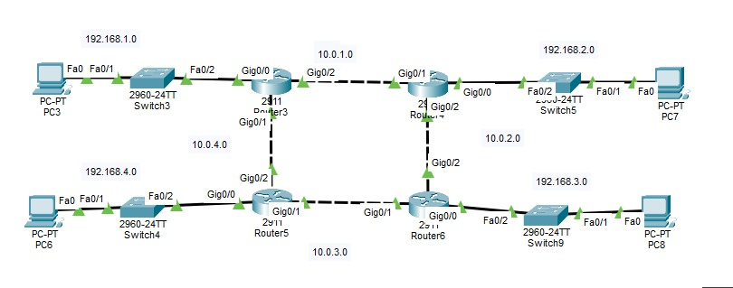

# Day 01 — Static Routing

## 📌 Overview

A hands-on Cisco Packet Tracer lab focused on configuring
IPv4 Static Routing across a 4-router network.

## 🎯 What I Built

- 4 routers
- 4 LAN networks
- 4 WAN links
- IPv4 addressing
- Static routes for end-to-end connectivity

## 🌐 Topology



## 📋 IP Addressing

| Network | Address |
|---|---|
| LAN 1 | 192.168.1.0/24 |
| LAN 2 | 192.168.2.0/24 |
| LAN 3 | 192.168.3.0/24 |
| LAN 4 | 192.168.4.0/24 |
| R1 ↔ R2 | 10.0.1.0/24 |
| R2 ↔ R3 | 10.0.2.0/24 |
| R3 ↔ R4 | 10.0.3.0/24 |
| R4 ↔ R1 | 10.0.4.0/24 |

## ⚙️ Key Commands

```cisco
interface g0/0
ip address <IP> <MASK>
no shutdown
````

### Static Route

```cisco
ip route <NETWORK> <MASK> <NEXT-HOP>
```

### Example

```cisco
ip route 192.168.2.0 255.255.255.0 10.0.1.2
```

## 🔍 Verification

```cisco
show ip interface brief
show ip route
ping <destination-ip>
traceroute <destination-ip>
```

✅ Verified routing tables
✅ Successfully tested end-to-end connectivity

## 🧠 Key Learnings

* How routers reach remote networks
* How static routes are configured
* How to identify routes using `show ip route`
* How to troubleshoot connectivity using Ping and Traceroute

## 📁 Lab File

[Download Static Routing Lab](Static-Routing.pkt)

---

### 🛠️ Tools

Cisco Packet Tracer • Cisco IOS • IPv4 • Static Routing
