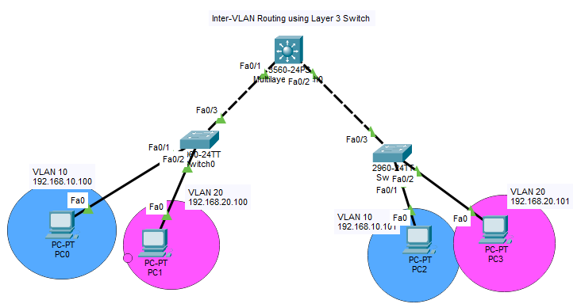

# Day 07 — Layer 3 Switch Routing

## 📌 Overview

A hands-on Cisco Packet Tracer lab focused on **Inter-VLAN Routing using a Cisco 3560 Multilayer Switch**.

The Layer 3 switch performs routing between VLAN 10 and VLAN 20 using **SVIs (Switched Virtual Interfaces)**.

## 🎯 What I Built

- Cisco 3560 Multilayer Switch
- Two Cisco 2960 Access Switches
- VLAN 10 — Engineering
- VLAN 20 — Sales
- Trunk links between switches
- SVIs for VLAN gateways
- Inter-VLAN routing
- End-to-end connectivity testing

## 🌐 Topology



## 📋 VLAN & IP Addressing

| VLAN | Network | Gateway |
|---|---|---|
| VLAN 10 | 192.168.10.0/24 | 192.168.10.1 |
| VLAN 20 | 192.168.20.0/24 | 192.168.20.1 |

## ⚙️ Key Configuration

### Create VLANs

```cisco
vlan 10
name Engineering

vlan 20
name Sales
```

### Configure Access Ports

```cisco
interface fa0/1
switchport mode access
switchport access vlan 10
```

```cisco
interface fa0/2
switchport mode access
switchport access vlan 20
```

### Configure Trunk

```cisco
interface fa0/3
switchport mode trunk
```

### Enable Layer 3 Routing

```cisco
ip routing
```

### Configure SVI

```cisco
interface vlan 10
ip address 192.168.10.1 255.255.255.0
no shutdown
```

```cisco
interface vlan 20
ip address 192.168.20.1 255.255.255.0
no shutdown
```

## 🔍 Verification

```cisco
show vlan brief
show interfaces trunk
show ip interface brief
show ip route
```

### Connectivity Test

```text
PC in VLAN 10 → PC in VLAN 20
```

```text
ping 192.168.20.101
```

✅ VLANs verified
✅ Trunk links verified
✅ SVIs configured
✅ Inter-VLAN routing enabled
✅ End-to-end connectivity tested

## 🧠 Key Learnings

* How Layer 3 switches perform routing
* How SVIs act as VLAN gateways
* Difference between Layer 2 switching and Layer 3 routing
* How VLANs communicate through a Multilayer Switch
* How to verify routing and connectivity

## 📁 Lab File

[Layer 3 Switch Routing Lab](Layer-3-Switch-Routing.pkt)

## 🛠️ Tools

Cisco Packet Tracer • Cisco IOS • VLAN • SVI • Inter-VLAN Routing
