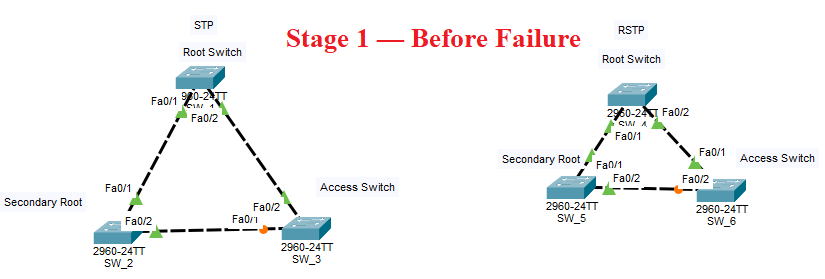
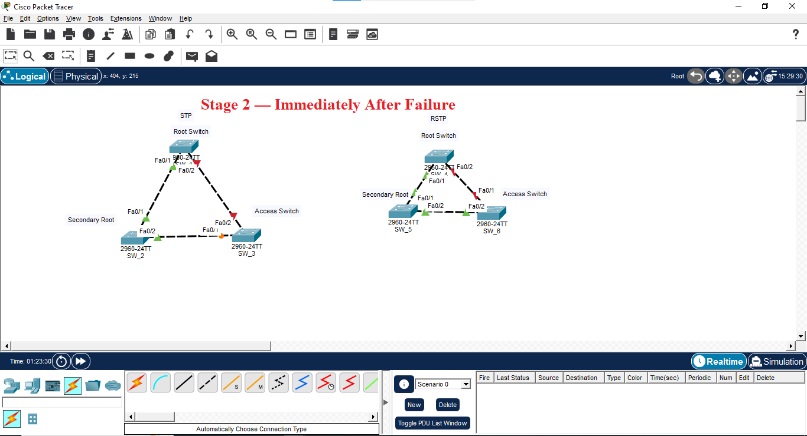
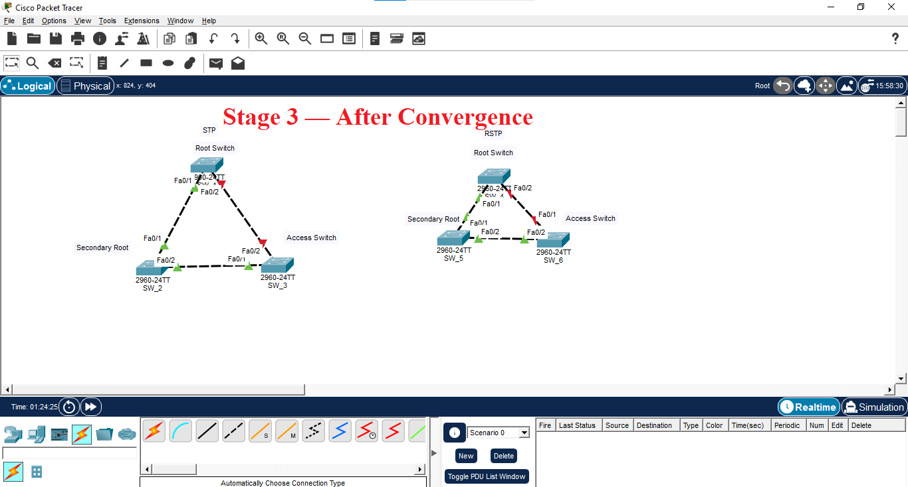

# STP vs RSTP — Link Failure Comparison

## 📌 Overview

A hands-on Cisco Packet Tracer comparison of **STP and RSTP** using the same 3-switch redundant topology.

The purpose of this lab was to observe how both protocols respond to a link failure and how the network recovers.

> **In every comparison image: STP = Left | RSTP = Right**

---

## 🌐 Topology

```text
             Root Switch
             /          \
            /            \
      Switch 1 ───────── Switch 3
````

Three switches form a redundant Layer 2 topology, creating an alternate path for STP/RSTP to manage.

---

## 🧪 Test Scenario

The same link-failure scenario was tested on both protocols.

### Stage 1 — Before Failure

Normal topology and STP/RSTP states were captured.



### Stage 2 — Immediately After Failure

The selected link was shut down and the immediate protocol response was captured.



### Stage 3 — After Convergence

The topology was checked again after the protocol completed its response to the failure.



---

## ⚙️ Protocol Configuration

### STP

```cisco
spanning-tree mode pvst
spanning-tree vlan 1 root primary
```

### RSTP

```cisco
spanning-tree mode rapid-pvst
spanning-tree vlan 1 root primary
```

---

## 🔍 Verification

```cisco
show spanning-tree
show spanning-tree vlan 1
```

Link failure:

```cisco
interface fa0/x
shutdown
```

Restore:

```cisco
interface fa0/x
no shutdown
```

---

## 📊 STP vs RSTP

| Feature          | STP             | RSTP               |
| ---------------- | --------------- | ------------------ |
| Standard         | 802.1D          | 802.1w             |
| Convergence      | Slower          | Faster             |
| Redundant paths  | Prevents loops  | Prevents loops     |
| Failure recovery | Traditional     | Rapid              |
| Main advantage   | Loop prevention | Faster convergence |

---

## 🧠 Key Learning

This lab demonstrated that STP and RSTP can both maintain a loop-free Layer 2 topology, while RSTP is designed for significantly faster topology recovery.

The comparison made the difference easier to understand by observing the network **before, immediately after, and after convergence**.

---

## 🛠️ Tools

* Cisco Packet Tracer
* Cisco IOS
* STP / PVST
* RSTP / Rapid PVST+
* Layer 2 Switching
