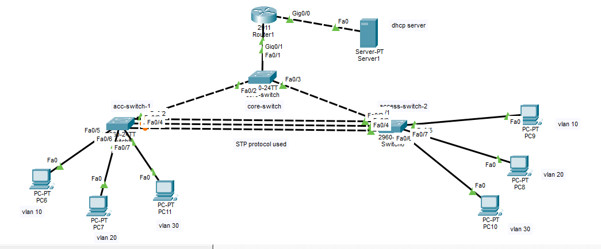

# Enterprise Hybrid Switching & Inter-VLAN Routing Capstone Network

## 📌 Project Overview
This project demonstrates a multi-tier Enterprise Branch Network designed and simulated in Cisco Packet Tracer. The network integrates advanced Layer 2 redundancy and trunking with Layer 3 Inter-VL[...] 

Built collaboratively as a hands-on project to practice core CCNA concepts including LACP EtherChannel, Rapid PVST+, Router-on-a-Stick, and DHCP Relay functionality.

---

## 🏗️ Network Architecture & Design

### **Core Components:**
* **Router:** 1x Cisco 2911 ISR (`Router1`)
* **Core Switch:** 1x Cisco 2960 (`core-switch` - Configured as Primary Root Bridge)
* **Access Switches:** 2x Cisco 2960 (`acc-switch-1`, `access-switch-2`)
* **Central Server:** 1x Dedicated DHCP Server (`Server1`)
* **End Devices:** 6x Workstations distributed across 3 distinct VLANs

### Topology Diagram

  

*Figure: Packet Tracer topology used for this lab. Place the topology image at `Day-11-P1_an _small_office _network/topology.png`. If you named the file differently, update the image path above.*

---

## ⚡ Technical Features & Protocols Implemented

1. **Layer 2 Segmentation (VLANs):**
   * `VLAN 10` (Sales) -> Subnet: `192.168.10.0/24`
   * `VLAN 20` (HR) -> Subnet: `192.168.20.0/24`
   * `VLAN 30` (IT) -> Subnet: `192.168.30.0/24`

2. **Link Aggregation (LACP EtherChannel):**
   * Configured a 2-port LACP EtherChannel (`Port-Channel 1`) between `acc-switch-1` and `access-switch-2` for high-throughput trunking and physical link redundancy.

3. **Spanning Tree Protocol (RSTP):**
   * Implemented **Rapid PVST+** (`spanning-tree mode rapid-pvst`).
   * Configured `core-switch` as the Primary Root Bridge (`spanning-tree vlan 1,10,20,30 root primary`) to ensure deterministic path selection and rapid convergence.

4. **Inter-VLAN Routing (Router-on-a-Stick):**
   * Utilized 802.1Q encapsulation on sub-interfaces (`Gig0/1.10`, `Gig0/1.20`, `Gig0/1.30`) to route traffic dynamically between distinct VLANs.

5. **Centralized IP Services (DHCP Relay):**
   * Hosted multi-scope DHCP services on a dedicated server connected via `Gig0/0` (`10.10.10.0/24`).
   * Configured `ip helper-address 10.10.10.2` on router sub-interfaces to forward cross-subnet DHCP broadcast requests.

---

## 🛠️ Verification Commands Used
* `show etherchannel summary` - Verified LACP state (`SU` / active ports).
* `show spanning-tree` - Confirmed Root Bridge election and loop prevention.
* `show ip route` & `show ip interface brief` - Validated sub-interface and gateway setup.
* `ping` & `traceroute` - Verified end-to-end connectivity across all VLANs and external server network.

---
🤝 **Collaborative Project** | Built as part of our CCNA Hands-On Networking Series.
