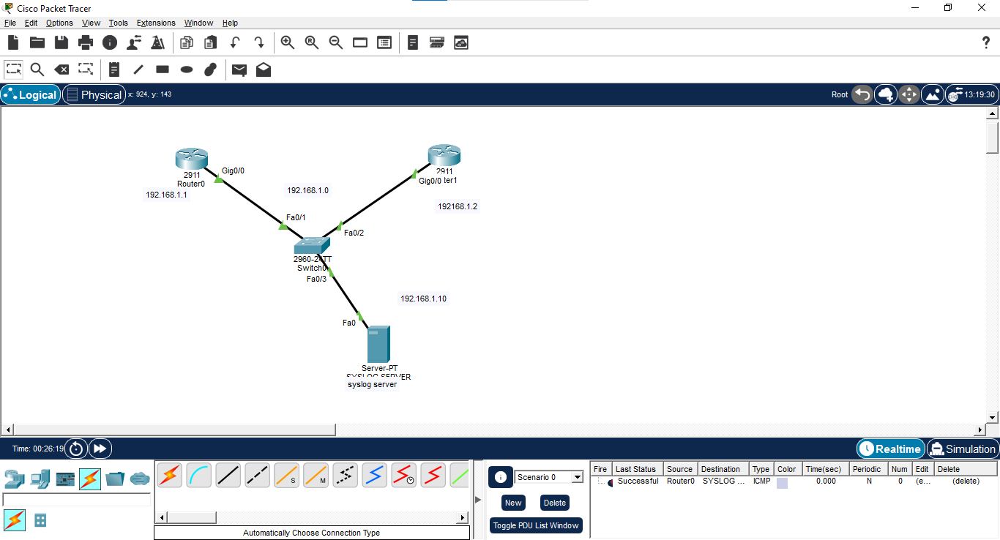
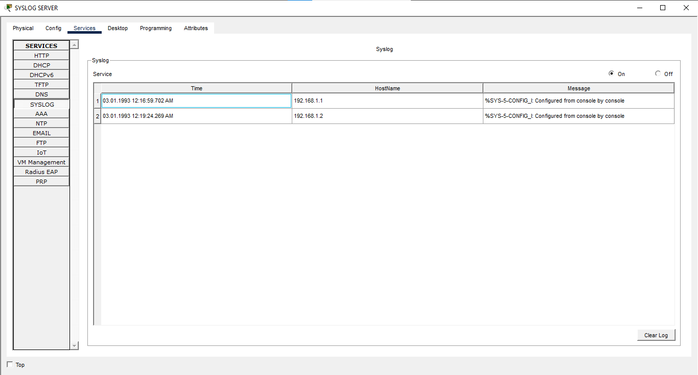
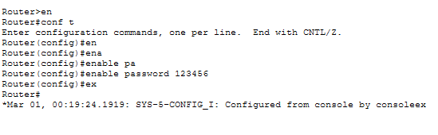

# Centralized Syslog Monitoring & Network Event Logging

## 📌 Project Overview
In enterprise networks, troubleshooting via individual device logging is highly inefficient. This project demonstrates the implementation of Centralized Syslog Monitoring in Cisco Packet Tracer, where multiple network devices (Routers & Switches) forward their system logs to a centralized Syslog Server. This enables real-time monitoring, centralized log aggregation, and streamlined troubleshooting across the entire network infrastructure.

---

## 🏗️ Architecture & Topology
* **Syslog Server:** Dedicated Server (`192.168.1.10`) acting as the central log collector.
* **Switch:** Cisco 2960 Switch bridging core nodes.
* **Routers (Router0 & Router1):** Cisco 2911 Routers configured to forward system logs over UDP to the central server.

### Network Topology Diagram


---

## 🌐 IP Addressing Scheme
* **Router0 (`Gig0/0`):** `192.168.1.1 /24`
* **Router1 (`Gig0/0`):** `192.168.1.2 /24`
* **Syslog Server (`Fa0`):** `192.168.1.10 /24` (Gateway: `192.168.1.1`)

---

## ⚙️ Key Configuration Commands

### Router Syslog Configuration:
```text
enable
configure terminal

interface gigabitEthernet 0/0
 ip address 192.168.1.X 255.255.255.0
 no shutdown
 exit

! Centralized Syslog Forwarding
logging host 192.168.1.10
service timestamps log datetime msec

end
write memory

```

### Syslog Server Configuration


---

## 🧪 Testing & Verification

### Event Generation & Centralized Proof
1. **Event Generation:** Triggered configuration changes and interface state adjustments across Router0 and Router1.
2. **Centralized Proof:** Verified that real-time notifications (such as `%SYS-5-CONFIG_I: Configured from console`) populated automatically on the central Syslog Server GUI.

### Server Log Display


### Server Verification


## 🛠️ Skills Covered

* Syslog & Enterprise Event Logging
* Cisco IOS CLI Configuration
* Centralized Network Visibility & Troubleshooting
* Packet Tracer Simulation

---

## 📁 Lab Files
* **lab.pkt** - Cisco Packet Tracer simulation file with complete network setup
