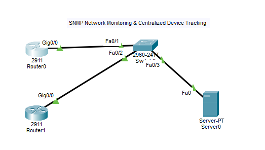
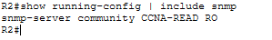

# SNMP Network Monitoring & Centralized Device Tracking

## 📌 Project Overview
In enterprise environments, administrators cannot manually log into every router to check device health. This project demonstrates the implementation of SNMP (Simple Network Management Protocol) in Cisco Packet Tracer to enable centralized network monitoring and metadata tracking using read-only community strings.

---

## 🏗️ Architecture & Topology



* **SNMP Management Server:** Dedicated Server (`192.168.10.10`) acting as the central management station (NMS) node for network mapping.
* **Switch:** Cisco 2960 Switch connecting core nodes.
* **Routers (R1 & R2):** Cisco 2911 Routers configured with SNMP agent parameters and community strings.

---

## 🌐 IP Addressing Scheme
* **R1 (`g0/0`):** `192.168.10.1 /24`
* **R2 (`g0/0`):** `192.168.10.2 /24`
* **SNMP Server:** `192.168.10.10 /24` (Gateway: `192.168.10.1`)

---

## ⚙️ Key Configuration Commands

### Router SNMP Setup (R1 & R2):
```text
enable
configure terminal

interface g0/0
 ip address 192.168.10.X 255.255.255.0
 no shutdown
 exit

! SNMP Agent Configuration
snmp-server community CCNA-READ ro

end
write memory

```


---

## 🧪 Verification & Testing

1. **Configuration Check:** Executed `show running-config | include snmp` to verify the read-only community string.
2. **Topology Integration:** Validated network connectivity from routers to the central management server via ping tests.



---

## 🛠️ Skills Covered

* SNMP (Simple Network Management Protocol)
* Centralized Network Monitoring & Management
* Cisco IOS CLI Configuration
* Packet Tracer Simulation

> ⚠️ **Security Note:** `CCNA-READ` uses SNMPv2c cleartext community strings, which is fine for lab environments. In production networks, **SNMPv3** is strictly preferred for authentication, data integrity, and encryption.
