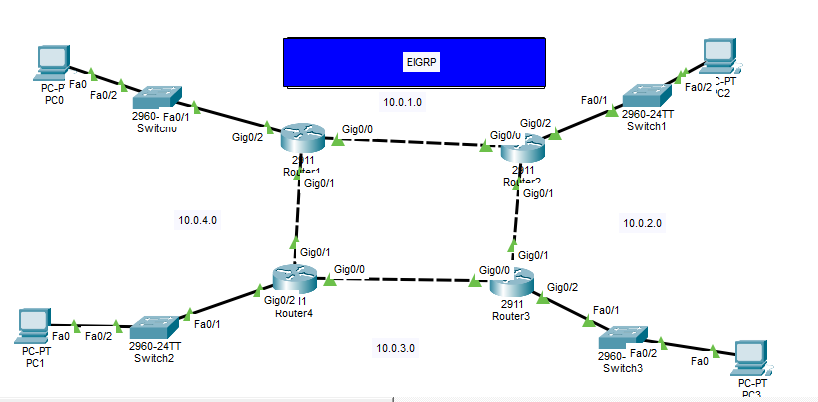
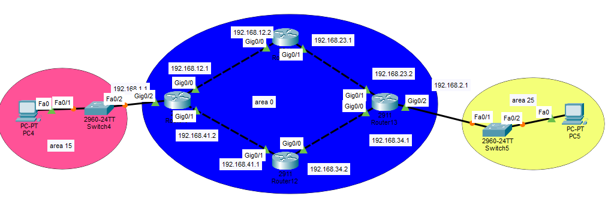
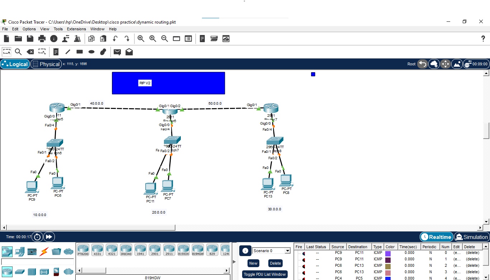
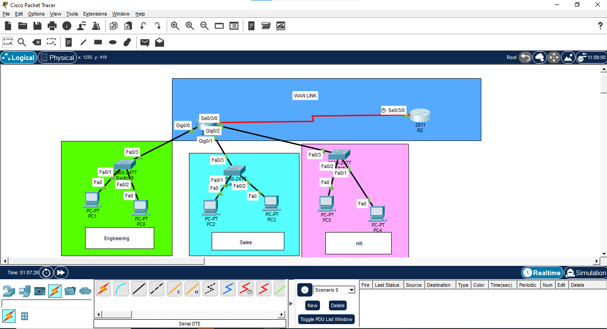
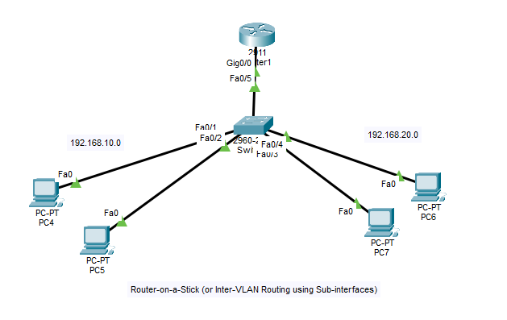

# Cisco Packet Tracer Networking Labs

A hands-on networking lab series documenting my journey from networking fundamentals to advanced Cisco configurations using Cisco Packet Tracer.

---

## 🚀 About This Repository

This repository contains Packet Tracer lab files (.pkt) and notes I build, configure, troubleshoot, and verify while learning networking and cybersecurity. Each lab focuses on one practical topic and contains topology files and step-by-step configuration notes where applicable.

---

## 📚 Labs (Day-by-day)

| Day | Topic | Key Concepts | Thumbnail |
|-----|-------|--------------|-----------|
| 01 | Static Routing | Routing tables, static routes, basic connectivity | [View Day 01](Day-01-static-routing/)     |
| 02 | EIGRP | Dynamic routing, neighbor establishment, metric | [View Day 02](Day-02-EIGRP/)     |
| 03 | OSPF | Link-state routing, areas, LSAs | [View Day 03](Day-03-OSPF/)     |
| 04 | RIP v2 | Distance-vector routing, timers, simple convergence | [View Day 04](Day-04-RIP/)     |
| 05 | VLSM + RIP v2 | Subnetting, efficient IP addressing, route summarization | [View Day 05](Day-05-VLSM/)     |
| 06 | VLAN | VLANs, access/trunk ports, inter-switch connectivity | [View Day 06](Day-06-VLAN/)     |
| 07 | Inter-VLAN Routing (using Layer 3 Switch) | SVI, inter-VLAN routing, gateway of last resort | [View Day 07](Day-07-INTER_VLAN_ROUTING_USING_LAYER3_SWITCH/)     |

> Note: Lab files are stored in their respective day folders. Open `.pkt` files with Cisco Packet Tracer. Thumbnails show the topology image for each lab (click the day link to open the folder).

---

## 🎯 Learning Goals

- Build strong networking fundamentals
- Practice Cisco IOS configuration and syntax
- Improve subnetting and IP addressing skills (VLSM)
- Understand and compare routing protocols (Static, RIP, EIGRP, OSPF)
- Configure VLANs and inter-VLAN routing
- Develop troubleshooting workflows and verification commands
- Begin building practical cybersecurity awareness (ACLs, segmentation)

---

## 🛠️ Tools & Technologies

- Cisco Packet Tracer (topology + simulation)
- Cisco IOS CLI (Router/Switch configuration)
- IPv4 (primary), IPv6 (where applicable)
- Bash / Markdown for documentation

---

## ✅ Progress

- [x] Static Routing
- [x] EIGRP
- [x] OSPF
- [x] RIP v2
- [x] VLSM
- [x] VLAN
- [x] Inter-VLAN Routing
- [ ] STP
- [ ] EtherChannel
- [ ] DHCP
- [ ] NAT
- [ ] ACL
- [ ] IPv6

(If you want to keep Day 07 as incomplete, I can revert the checkmark — tell me which you prefer.)

---

## 📂 Repository Structure

- Day-01-static-routing/
- Day-02-EIGRP/
- Day-03-OSPF/
- Day-04-RIP/
- Day-05-VLSM/
- Day-06-VLAN/
- Day-07-INTER_VLAN_ROUTING_USING_LAYER3_SWITCH/
- README.md

Each Day folder contains:
- .pkt (Packet Tracer file)
- optionally: notes.md or configs.txt with CLI commands and verification output

---

## 🔎 How to Use These Labs

1. Install Cisco Packet Tracer (recommended version noted per-lab if applicable).
2. Clone or download this repository.
3. Open the `.pkt` file for the desired lab in Packet Tracer.
4. Review the included notes (if any) and follow configuration steps in simulation or CLI mode.
5. Use `show` and `ping/traceroute` commands to verify connectivity and routing.

Suggested verification commands:
- show ip route
- show ip interface brief
- show running-config
- ping <ip>
- traceroute <ip>

---

## License & Contact

- License: MIT (or specify another license if you prefer)
- Contact: @Tahaansaribinjaved (GitHub)

---

## Appendix — Suggested Next Labs

- STP basics and verification
- EtherChannel (LACP / PAgP) and verification
- DHCP (server & relay)
- NAT (static & PAT)
- ACLs for segmentation and basic security
- IPv6 addressing and routing
